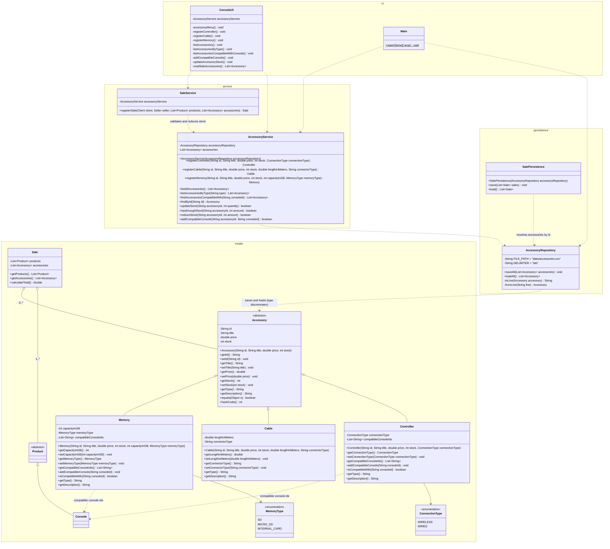

# Accessory Module Class Diagram

This diagram shows the accessory module and how it integrates with the existing classes of the system, organized by layer: the `Accessory` hierarchy with its attributes, methods, and inheritance relationships; its persistence and service classes; and the integration with `Sale`, `SaleService`, `SalePersistence`, and the console menu. Classes not involved in the accessory module are omitted for readability; see `class-diagram.md` for the base system and `integrated-class-diagram.md` for the complete integrated system.

