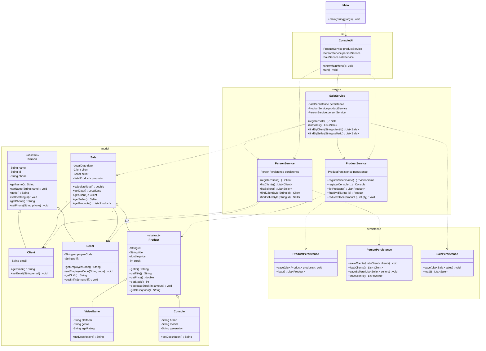

# Class Diagram

This diagram represents all classes across the four layers, including attributes, methods, visibility, and relationships.

```mermaid
classDiagram
namespace model {
class Person {
<<abstract>>
-String name
-String id
-String phone
+getName() String
+setName(String name) void
+getId() String
+setId(String id) void
+getPhone() String
+setPhone(String phone) void
}

        class Client {
            -String email
            +getEmail() String
            +setEmail(String email) void
        }

        class Seller {
            -String employeeCode
            -String shift
            +getEmployeeCode() String
            +setEmployeeCode(String code) void
            +getShift() String
            +setShift(String shift) void
        }

        class Product {
            <<abstract>>
            -String id
            -String title
            -double price
            -int stock
            +getId() String
            +getTitle() String
            +getPrice() double
            +getStock() int
            +decreaseStock(int amount) void
            +getDescription()* String
        }

        class VideoGame {
            -String platform
            -String genre
            -String ageRating
            +getDescription() String
        }

        class Console {
            -String brand
            -String model
            -String generation
            +getDescription() String
        }

        class Sale {
            -LocalDate date
            -Client client
            -Seller seller
            -List~Product~ products
            +calculateTotal() double
            +getDate() LocalDate
            +getClient() Client
            +getSeller() Seller
            +getProducts() List~Product~
        }
    }

    namespace persistence {
        class ProductPersistence {
            +save(List~Product~ products) void
            +load() List~Product~
        }

        class PersonPersistence {
            +saveClients(List~Client~ clients) void
            +loadClients() List~Client~
            +saveSellers(List~Seller~ sellers) void
            +loadSellers() List~Seller~
        }

        class SalePersistence {
            +save(List~Sale~ sales) void
            +load() List~Sale~
        }
    }

    namespace service {
        class ProductService {
            -ProductPersistence persistence
            +registerVideoGame(...) VideoGame
            +registerConsole(...) Console
            +listProducts() List~Product~
            +findById(String id) Product
            +reduceStock(Product p, int qty) void
        }

        class PersonService {
            -PersonPersistence persistence
            +registerClient(...) Client
            +listClients() List~Client~
            +listSellers() List~Seller~
            +findClientById(String id) Client
            +findSellerById(String id) Seller
        }

        class SaleService {
            -SalePersistence persistence
            -ProductService productService
            -PersonService personService
            +registerSale(...) Sale
            +listSales() List~Sale~
            +findByClient(String clientId) List~Sale~
            +findBySeller(String sellerId) List~Sale~
        }
    }

    namespace ui {
        class ConsoleUI {
            -ProductService productService
            -PersonService personService
            -SaleService saleService
            +showMainMenu() void
            +run() void
        }
    }

    class Main {
        +main(String[] args) void
    }

    Person <|-- Client
    Person <|-- Seller
    Product <|-- VideoGame
    Product <|-- Console

    Sale "1" --> "1" Client
    Sale "1" --> "1" Seller
    Sale o-- Product : 1..*

    ProductService ..> ProductPersistence
    PersonService ..> PersonPersistence
    SaleService ..> SalePersistence

    SaleService ..> ProductService
    SaleService ..> PersonService

    ProductService ..> Product
    PersonService ..> Client
    PersonService ..> Seller
    SaleService ..> Sale

    ConsoleUI ..> ProductService
    ConsoleUI ..> PersonService
    ConsoleUI ..> SaleService

    Main ..> ConsoleUI
```