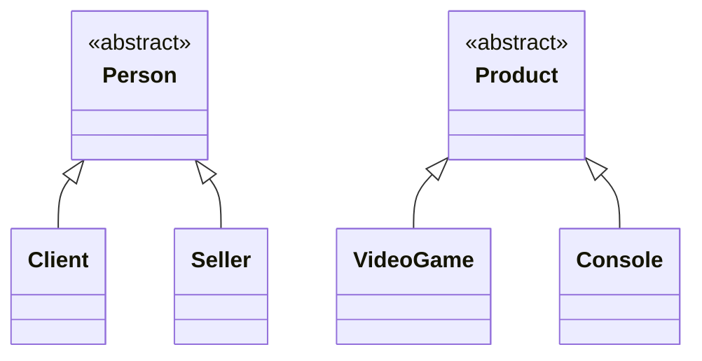

# Hierarchy Diagram

This diagram shows the inheritance relationships in the domain model.

```mermaid
classDiagram
class Person {
<<abstract>>
}
class Client
class Seller

    class Product {
        <<abstract>>
    }
    class VideoGame
    class Console

    Person <|-- Client
    Person <|-- Seller
    Product <|-- VideoGame
    Product <|-- Console
```