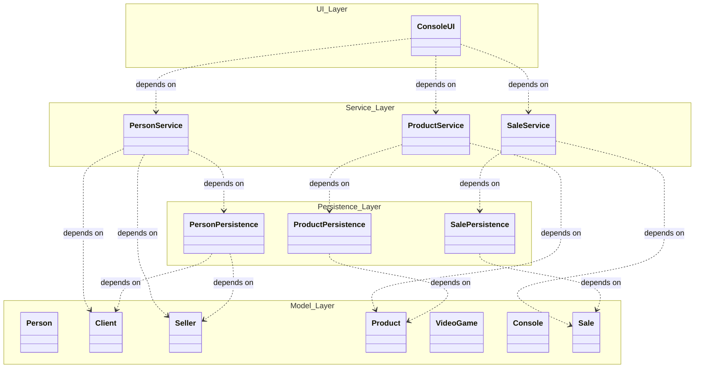

# Layers Diagram

This diagram represents the architectural organization of the system into four layers and the allowed dependencies between them.

```mermaid
classDiagram
    namespace UI_Layer {
        class ConsoleUI
    }

    namespace Service_Layer {
        class ProductService
        class PersonService
        class SaleService
    }

    namespace Persistence_Layer {
        class ProductPersistence
        class PersonPersistence
        class SalePersistence
    }

    namespace Model_Layer {
        class Person
        class Client
        class Seller
        class Product
        class VideoGame
        class Console
        class Sale
    }

    ConsoleUI ..> ProductService : depends on
    ConsoleUI ..> PersonService : depends on
    ConsoleUI ..> SaleService : depends on

    ProductService ..> ProductPersistence : depends on
    PersonService ..> PersonPersistence : depends on
    SaleService ..> SalePersistence : depends on

    ProductService ..> Product : depends on
    PersonService ..> Client : depends on
    PersonService ..> Seller : depends on
    SaleService ..> Sale : depends on

    ProductPersistence ..> Product : depends on
    PersonPersistence ..> Client : depends on
    PersonPersistence ..> Seller : depends on
    SalePersistence ..> Sale : depends on
```