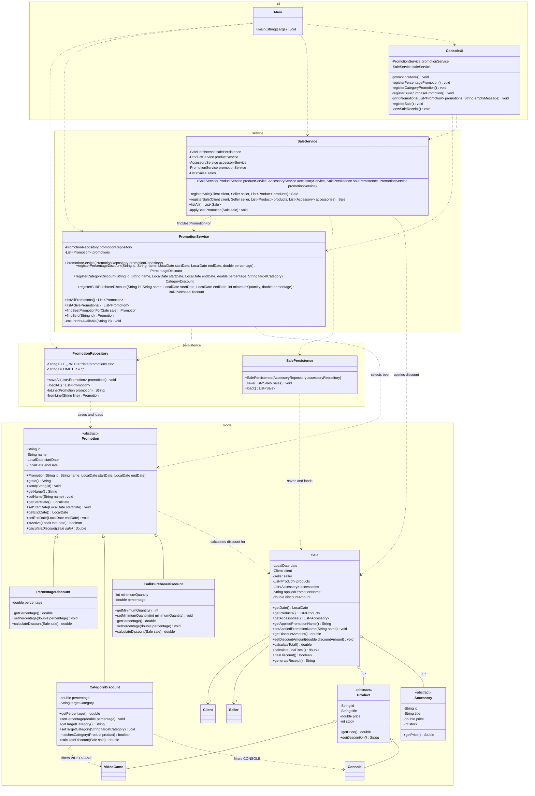

# Promotion Module Class Diagram

This diagram shows the promotion module and how it integrates with the existing classes of the system, organized by layer. It includes the new promotion hierarchy with its attributes, methods, and inheritance relationships; the new persistence and service classes; and the relationships with `Sale`, `SaleService`, and `Product` (used by category promotions). Classes of the system not involved in the promotion module are omitted for readability; see `class-diagram.md` for the complete base system.

