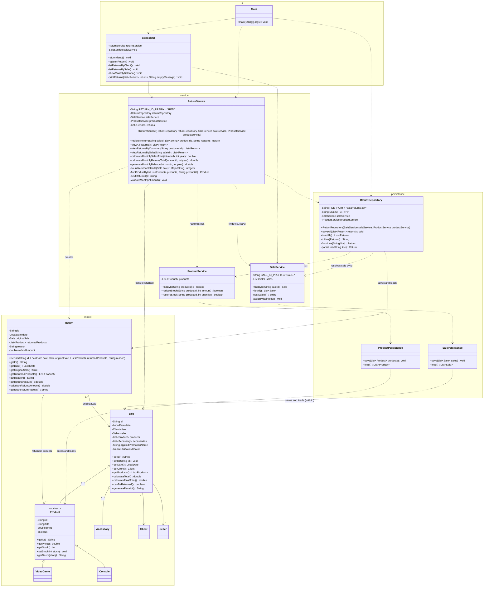

# Return Module Class Diagram

This diagram shows the return module and how it integrates with the existing classes of the system, organized by layer. It includes the new `Return` class with its attributes, methods, and its association with the existing `Sale` class; the new persistence and service classes; and the integration with `Sale` (sale id and `canBeReturned()`), `ProductService` (`restoreStock()`), and the extension of the console menu. Classes of the system not involved in the return module are omitted for readability; see `class-diagram.md` for the complete base system and `promotion-class-diagram.md` for the promotion module.

